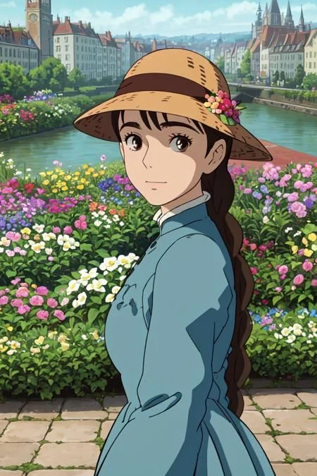
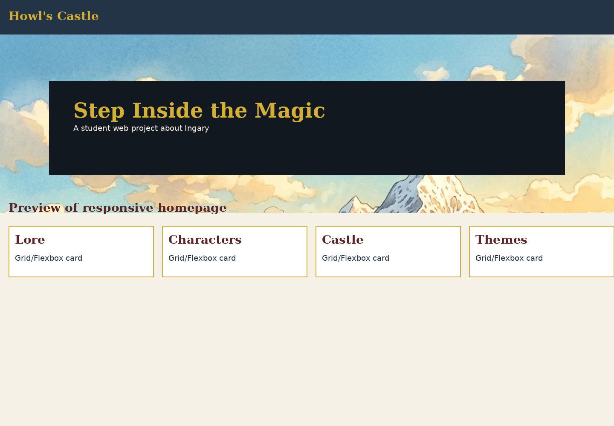
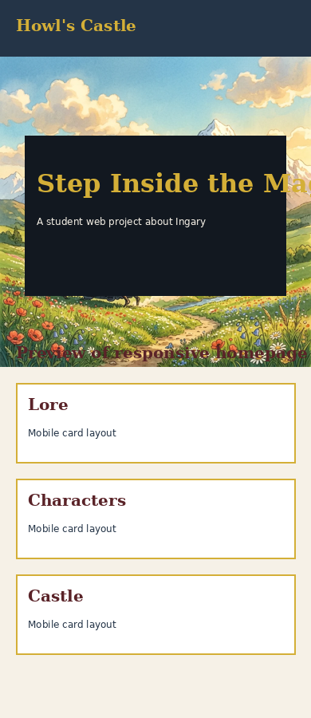

# howl_finished

Školní web do předmětu **Webové technologie**.
Téma webu je *Howl's Moving Castle*.

Živý web po nasazení:

```text
https://mo6ul.github.io/web-page/
```

Pokud se repozitář jmenuje jinak, je potřeba upravit odkazy v `sitemap.xml`, `robots.txt` a v HTML souborech.

---

## 1. O projektu

Web je fanouškovská prezentace o filmu a příběhu *Howl's Moving Castle*.
Obsahuje hlavní stránku, informace o díle, postavy, galerii a kontakt.

Web je vytvořen bez frameworků.
Použité jsou pouze:

- HTML5
- CSS3
- Vanilla JavaScript

---

## 2. Struktura projektu

```text
howl_finished/
├── index.html
├── about.html
├── characters.html
├── gallery.html
├── contact.html
├── css/
│   └── style.css
├── js/
│   ├── script.js
│   └── translations.js
├── images/
├── screenshots/
├── robots.txt
├── sitemap.xml
└── README.md
```

---

## 3. Hlavní funkce webu

- responzivní design pro mobil, notebook i PC
- horní navigace
- mobilní hamburger menu
- tmavý a světlý režim
- přepínání jazyka CZ / EN
- stránka s postavami
- galerie s filtrem a náhledem obrázku
- kontaktní formulář s kontrolou vstupů
- tlačítko zpět nahoru

---

## 4. Optimalizace

### Performance

Obrázky jsou ve formátu WebP a používají lazy loading.

```html

```

JavaScript se načítá pomocí `defer`.

```html
<script src="js/script.js" defer></script>
```

---

### SEO

Každá stránka má vlastní title a description.

```html
<title>Postavy | Howl's Moving Castle</title>
<meta name="description" content="Postavy z příběhu Howl's Moving Castle.">
```

Projekt obsahuje také:

- `sitemap.xml`
- `robots.txt`
- canonical odkazy
- Open Graph tagy

---

### Accessibility

Web má alt texty u obrázků, labely u formuláře a viditelný focus stav.

```html
<label for="email">E-mailová adresa:</label>
<input id="email" type="email">
```

Mobilní menu používá `aria-expanded`.

```html
<button aria-expanded="false" aria-controls="nav-menu">
  Menu
</button>
```

---

### Sociální sítě

V HTML jsou Open Graph a Twitter/X tagy.

```html
<meta property="og:title" content="Howl's Moving Castle">
<meta property="og:image" content="images/hero_castle.webp">
<meta name="twitter:card" content="summary_large_image">
```

---

### UI / UX

Layout používá CSS Grid, Flexbox a media queries.
Web se přizpůsobí mobilu i větší obrazovce.

```css
.gallery-grid {
  display: grid;
  grid-template-columns: repeat(auto-fit, minmax(220px, 1fr));
}
```

---

### AI integrace

AI jsem použil jako pomoc při textech, CSS, JavaScriptu a překladech. Výsledek jsem potom upravil ručně podle projektu.

---

## 5. AI deník

| Prompt | Výsledek |
|---|---|
| Napiš jednoduché texty o hlavních postavách. | První verze textů pro web. |
| Pomoz mi vylepšit responzivní CSS pro mobil, tablet a počítač. | Lepší rozložení stránky, úprava velikostí a media queries. |
| Navrhni zlepšení JavaScriptu bez frameworků. | Vylepšení menu, galerie a formuláře pomocí čistého JavaScriptu. |
| Pomoz mi opravit problémy s překladem mezi angličtinou a češtinou. | Přirozenější české texty a oprava nepřesných překladů. |

---

## 6. Spuštění projektu

### Jednoduché otevření

1. Stáhnout projekt.
2. Rozbalit ZIP.
3. Otevřít `index.html` v prohlížeči.

### Live Server

1. Otevřít složku ve VS Code.
2. Nainstalovat rozšíření **Live Server**.
3. Kliknout pravým tlačítkem na `index.html`.
4. Zvolit **Open with Live Server**.

---

## 7. GitHub Pages

1. Vytvořit public repozitář na GitHubu.
2. Nahrát všechny soubory projektu.
3. Otevřít **Settings → Pages**.
4. Vybrat branch `main` a složku `/root`.
5. Uložit a počkat na odkaz.

---

## 8. Screenshoty

Desktop:



Mobil:



---

## 9. Testování

Otestováno ručně:

- mobilní menu
- přepínání jazyka
- tmavý režim
- galerie
- kontaktní formulář
- responzivita na mobilu a PC

---

## 10. Poznámka

Tento web je pouze školní fanouškovský projekt.
