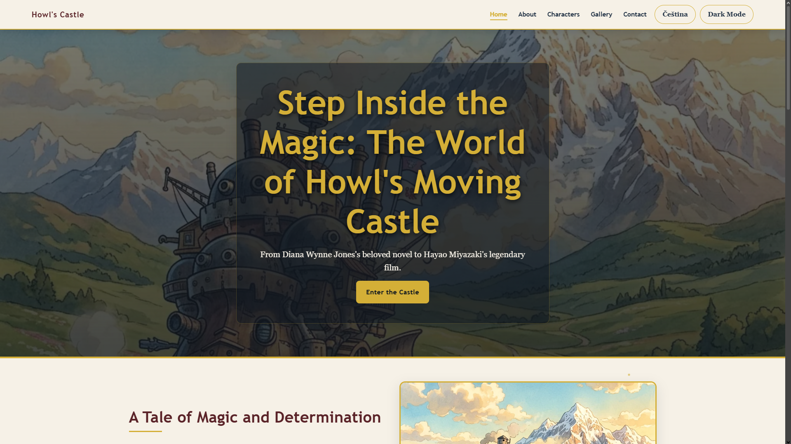
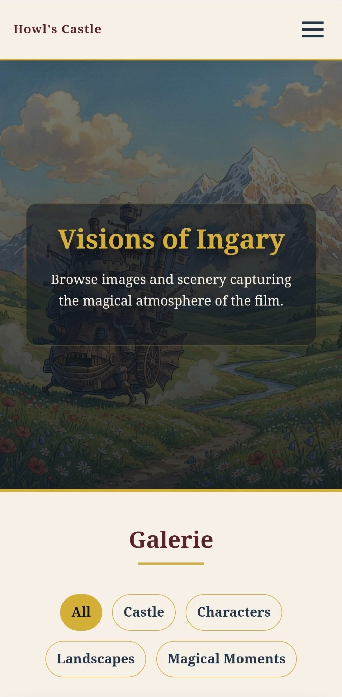

# howl_finished

Školní web do předmětu **Webové technologie**.  
Téma webu je **Howl's Moving Castle**.

Živý web: [https://mo6ul.github.io/web-page/](https://mo6ul.github.io/web-page/)

---

## 1. O projektu

Tento web je fanouškovská prezentace o filmu **Howl's Moving Castle**.

Téma jsem si vybral, protože mám rád filmy od **Studia Ghibli** a tento film má zajímavý svět, atmosféru, postavy a vizuální styl.

Web obsahuje:

- hlavní stránku
- informace o filmu
- postavy
- galerii
- kontakt

Web je vytvořen bez frameworků, pouze pomocí **HTML, CSS a Vanilla JavaScriptu**.

---

## 2. Struktura projektu

```text
web-page/
├── css/
│   └── style.css
├── images/
├── js/
│   ├── script.js
│   └── translations.js
├── README.md
├── about.html
├── characters.html
├── contact.html
├── gallery.html
├── index.html
├── mobile-home-preview.png
├── mobile-preview.jpg
├── robots.txt
└── sitemap.xml
```

---

## 3. Hlavní funkce

- responzivní design pro mobil, notebook i PC
- horní navigace
- mobilní hamburger menu
- tmavý / světlý režim
- přepínání jazyka CZ / EN
- stránka s postavami
- galerie s filtrem
- kontaktní formulář
- tlačítko zpět nahoru

---

## 4. Optimalizace

### Performance

Obrázky používají lazy loading.

```html

```

JavaScript se načítá pomocí `defer`.

```html
<script src="js/script.js" defer></script>
```

### SEO

Každá stránka má vlastní title a description.

```html
<title>Howl's Moving Castle</title>
<meta name="description" content="Webová prezentace o filmu Howl's Moving Castle.">
```

Projekt obsahuje také `robots.txt` a `sitemap.xml`.

### Accessibility

Použil jsem alt texty, labely u formuláře a lepší kontrast.

```html
<label for="email">Email Address:</label>
<input id="email" type="email">
```

### Sociální sítě

Web obsahuje Open Graph tagy.

```html
<meta property="og:title" content="Howl's Moving Castle">
<meta property="og:type" content="website">
```

### UI / UX

Web používá Flexbox, Grid a media queries.

```css
.gallery-grid {
  display: grid;
  grid-template-columns: repeat(auto-fit, minmax(220px, 1fr));
}
```

### AI integrace

AI jsem použil jako pomoc při textech, CSS, JavaScriptu a překladech.  
Výsledek jsem potom upravil podle svého projektu.

---

## 5. AI deník

| Prompt | Výsledek |
|---|---|
| Napiš jednoduché texty o hlavních postavách. | První verze textů pro web. |
| Pomoz mi vylepšit responzivní CSS pro mobil, tablet a počítač. | Lepší rozložení stránky a media queries. |
| Navrhni zlepšení JavaScriptu bez frameworků. | Vylepšení menu, galerie a formuláře. |
| Pomoz mi opravit problémy s překladem mezi angličtinou a češtinou. | Přirozenější české texty. |

---

## 6. Spuštění projektu

1. Stáhnout projekt.
2. Otevřít složku ve VS Code.
3. Spustit `index.html` přes **Live Server**.

Nebo otevřít `index.html` přímo v prohlížeči.

---

## 7. Screenshoty

### PC verze



### Mobilní verze



---

## 8. Testování

Otestoval jsem:

- navigaci
- mobilní menu
- tmavý režim
- přepínání jazyka
- galerii
- kontaktní formulář
- zobrazení na mobilu a PC

---

## Autor

Dayan Batbold
